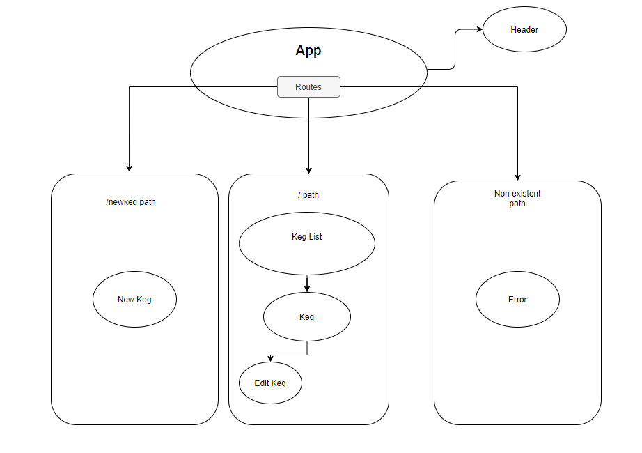

# _The Tap Room_

#### _Beer Tap Management in React , 2/14/2020_

#### By _**Calvin Will**_

## Description
_The Tap Room is a simple website aimed to be used by employees and customers of a tap room. It is built using React._

## Components and Route Structure

## Setup/Installation Requirements

* _Clone from GitHub_
* _Navigate to the projet folder_
* _run the command "npm install" _
* _Run the command "npm run start"_

## Known Bugs

_Currently there are no known bugs_

## Support and contact details

_For questions comments and concerns, email me at calvinp003@gmail.com_

## Technologies Used

* _React_

### License

*Licensed Under MIT*

Copyright (c) 2020 **_Calvin Will_**
